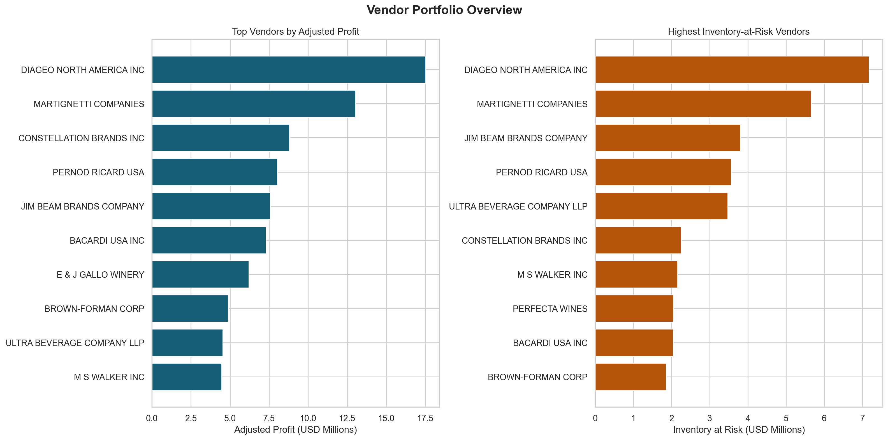
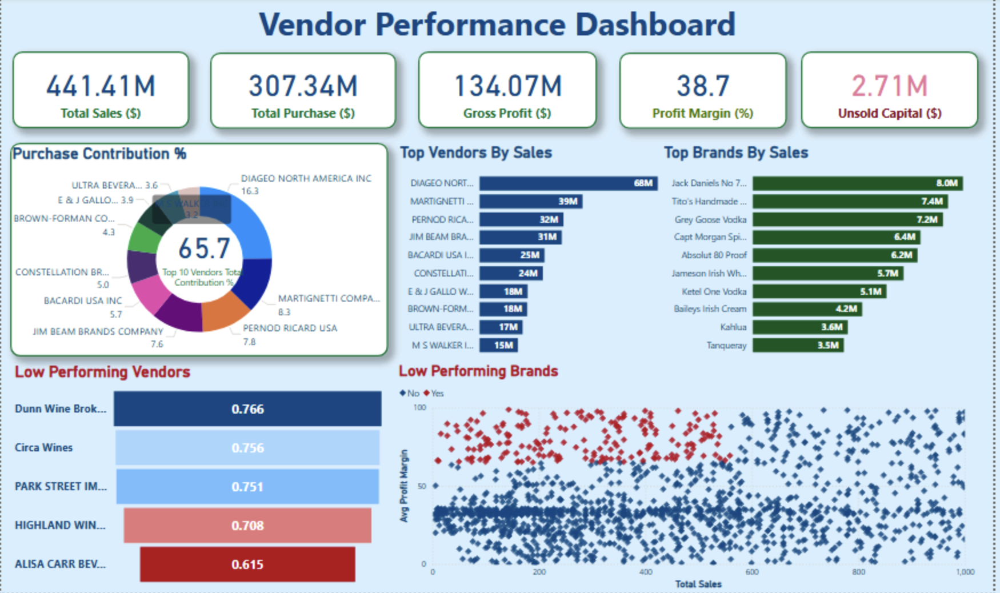

# Vendor Performance & Cost Optimization Analysis

## Business Problem

Procurement teams often know who they buy from, but not which vendors are truly creating commercial value after freight, inventory drag, and sell-through quality are considered. This project reframes vendor reporting into an executive supplier portfolio review suitable for consulting, FMCG, retail, and operations analytics roles.

## Objective

Build an end-to-end vendor analytics workflow that:

- resolves large local-only raw files without uploading them to GitHub
- cleans and combines procurement, sales, pricing, freight, and inventory data
- scores vendors on profitability, scale, service quality, and sell-through
- exports recruiter-friendly outputs for SQL, dashboards, and business review

## Dataset Strategy

- Full raw dataset: stored locally in `data/raw/` and excluded from GitHub
- GitHub-safe sample files: stored in `data/sample/`
- Processed outputs: written to `data/processed/`
- Automated ingestion options:
  - local-first via `VENDOR_DATA_DIR`
  - Google Drive via `data/data_sources.json`
  - Kaggle via `data/data_sources.json`
  - sample fallback if full raw files are unavailable

Raw files expected by the project:

- `purchases.csv`
- `sales.csv`
- `purchase_prices.csv`
- `vendor_invoice.csv`
- `begin_inventory.csv`
- `end_inventory.csv`

## Project Structure

```text
Vendor Performance & Cost Optimization Analysis/
├── assets/
├── dashboard/
├── data/
│   ├── raw/
│   ├── sample/
│   └── processed/
├── notebooks/
├── reports/
├── scripts/
│   └── sql/
├── README.md
└── requirements.txt
```

## Methodology

1. Bootstrap raw data from local storage, Google Drive, Kaggle, or sample files.
2. Clean transaction, price reference, invoice, and inventory snapshots.
3. Join procurement and sales data at vendor-brand-category level.
4. Integrate beginning and ending inventory snapshots to strengthen inventory risk measurement.
5. Calculate vendor KPIs including adjusted profit, adjusted margin, sell-through, stock turnover, and concentration share.
6. Score vendors into `High Impact`, `Stable`, `Watchlist`, and `Critical` performance tiers.
7. Export analytics tables, SQLite-ready CSVs, and dashboard assets.

## KPIs Used

- Total Revenue
- Total Procurement Cost
- Adjusted Profit
- Adjusted Profit Margin
- Inventory at Risk
- Ending Inventory Units
- Sell-Through Rate
- Stock Turnover
- Revenue Share by Vendor
- Vendor Performance Score

## Key Insights

- The portfolio generated **$452.06M** in revenue and **$128.52M** in adjusted profit across **129 vendors**.
- The top 10 vendors contribute **64.99%** of total revenue, highlighting material supplier concentration risk.
- Ending inventory reached **4.77M units**, with **$54.41M** flagged as inventory at risk.
- **14 vendors** are currently negative on adjusted profit, and the action watchlist has been narrowed to the top **25** commercial risk cases.
- Classification `1` drives more revenue, but Classification `2` delivers stronger adjusted-profit quality with lower inventory burden.

## Business Recommendations

- Launch a tiered supplier strategy that separates strategic vendors from renegotiation and rationalization candidates.
- Prioritize inventory-heavy and low-sell-through suppliers for purchasing controls, order-frequency changes, and commercial review.
- Protect the top `High Impact` vendors with tighter forecasting and service management because they drive a disproportionate share of the profit pool.

## Measurable Business Impact

Reducing inventory at risk by **10%** would release approximately **$5.44M** in working capital without requiring additional revenue growth.

## Dashboard Screenshots

Executive asset generated from the pipeline:



Existing dashboard preview:



## How To Run

### 1. Install dependencies

```bash
python3 -m pip install -r requirements.txt
```

### 2. Choose a data path

Option A: local raw data already available

```bash
python3 scripts/bootstrap_data.py
```

Option B: configure Google Drive or Kaggle

```bash
cp data/data_sources.example.json data/data_sources.json
python3 scripts/bootstrap_data.py
```

Option C: run with GitHub-safe sample data only

```bash
python3 scripts/run_pipeline.py
```

### 3. Run the full pipeline

```bash
python3 scripts/run_pipeline.py
```

### 4. Export recruiter-facing chart assets

```bash
python3 scripts/export_dashboard_assets.py
```

## Main Outputs

- `data/processed/vendor_performance_summary.csv`
- `data/processed/vendor_brand_performance.csv`
- `data/processed/vendor_category_performance.csv`
- `data/processed/category_performance_summary.csv`
- `data/processed/vendor_watchlist.csv`
- `data/processed/vendor_tier_summary.csv`
- `data/processed/vendor_performance.db`

## Why This Project Is Portfolio-Ready

- Solves the GitHub large-file problem cleanly without uploading raw data.
- Demonstrates analyst skills across data engineering, KPI design, risk scoring, SQL, and business storytelling.
- Produces outputs that are easy for recruiters, hiring managers, and dashboard reviewers to inspect quickly.
